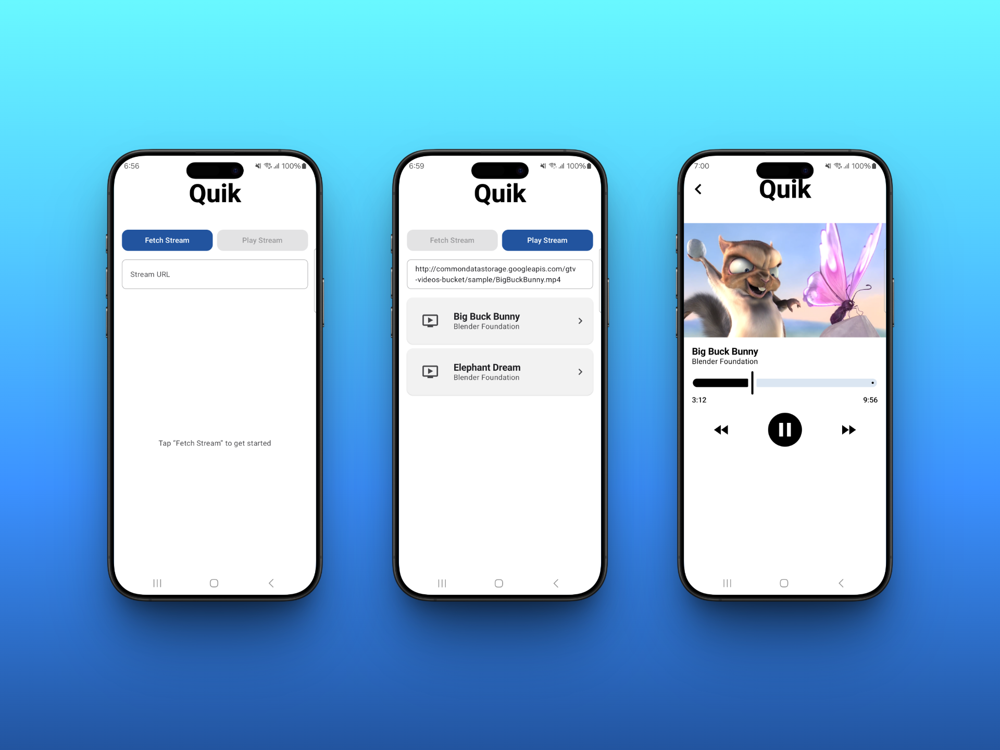
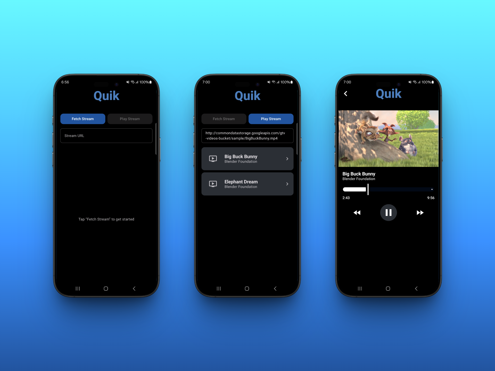

# QuikStream

A lightweight Android application for browsing and playing video streams, designed to demonstrate
modern Android development best practices using Kotlin, Jetpack Compose, Hilt DI, Retrofit, and
Coroutines.

---

## 📸 App Screenshots

Light theme:  


Dark theme:  


---

## 🚀 Overview

QuikStream fetches a curated list of video streams from a GitHub-hosted JSON endpoint and displays
them in a polished, responsive UI. Users can:

- **Fetch** the latest stream listings.
- **Select** a stream to view its URL.
- **Play** the selected stream using ExoPlayer within the app.

This project is structured according to clean architecture principles, separating concerns into *
*Data**, **Domain**, and **UI** layers.

---

## 🏛️ Architecture

```
┌───────────────────────────────┐
│          Presentation         │
│ (Jetpack Compose + ViewModel) │
└──────────────┬────────────────┘
               │
┌──────────────▼────────────────┐
│           Domain              │
│   (UseCases, Models, Repos)   │
└──────────────┬────────────────┘
               │
┌──────────────▼────────────────┐
│            Data               │
│  (RemoteDataSource, Retrofit) │
└───────────────────────────────┘
```

- **Data Layer**: `StreamRemoteDataSource` uses Retrofit & Kotlinx Serialization to fetch
  `StreamsResponse`.
- **Domain Layer**: `GetStreamsUseCase`, `StreamRepository` interface, and `Stream` model
  encapsulate business rules.
- **Presentation Layer**: `MainViewModel`, `PlaybackViewModel`, and Composable UIs render state via
  `MainUiState`.

---

## 🛠️ Features

- **Kotlin Coroutines & Flow** for asynchronous data streams.
- **Jetpack Compose** for declarative, reactive UI.
- **Hilt** for dependency injection.
- **Retrofit** + **Kotlinx Serialization** for type-safe HTTP.
- **ExoPlayer** integration for video playback.
- **Unit Tests** with JUnit, MockK, and Turbine.
- **UI Tests** with Compose Testing and `testTag` selectors.

---

## 📋 Prerequisites

- Android Studio Electric Eel or later.
- JDK 11
- Android SDK Platform 35
- Internet connection for fetching remote JSON.

---

## 🛠️ Getting Started

1. **Clone the repository**

   ```bash
   git clone https://github.com/sceballosdev/QuikStream.git
   cd QuikStream
   ```

2. **Configure local properties**

    - Create or update `local.properties` with your Android SDK path:
      ```properties
      sdk.dir=/path/to/Android/Sdk
      ```

3. **Open in Android Studio**

    - Select **Open an existing project** and choose the root folder.

---

## ▶️ Build & Run

- **Via Android Studio**: Click **Run ▶️** on the `app` module.
- **Via CLI**:
  ```bash
  ./gradlew assembleDebug
  ./gradlew installDebug
  ```

---

## 🧪 Testing

### Unit Tests

```bash
./gradlew testDebugUnitTest
```

- **MockK** for mocking dependencies.
- **Turbine** for Flow testing.

### UI Tests (Compose)

```bash
./gradlew connectedDebugAndroidTest
```

- Uses `createComposeRule()` and `Modifier.testTag` to locate UI elements.

---

## 📁 Project Structure

```
QuikStream/
├── app/                     # Android application module
│   ├── src/main/java/...    # Source code (Data, Domain, UI)
│   ├── src/test/            # Unit tests
│   └── src/androidTest/     # Instrumented & UI tests
├── build.gradle.kts         # Project build configuration
├── settings.gradle.kts      # Project settings
└── README.md                # Project documentation
```

---

## 📦 Dependencies

- **Kotlin** 2.2.0
- **Agp** 8.11.0
- **Compose** BOM 2025.06.01
- **Hilt** 2.56.2
- **Retrofit** 3.0.0
- **ExoPlayer** 1.7.1
- **MockK** 1.14.4
- **Turbine** 1.2.1

---